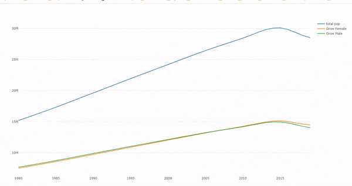

## Assignment week 3
### Plotly

<p> 
Note: I need to do this assignment this way because Markdown doesn't read the graph to plot </p>


My project consists of graphing lines with the indicators obtained from World Bank Data after  I going to found indicators for my country and created a data frame,With this data frame, I am going to make a diagram
## 3 Librarie

```{r setup, include=FALSE}
library(wbstats); library(WDI);
library(tidycensus)
library(tidyverse)
library(sf)
library(plotly)
library(tidyr)
library(plyr)
```


### Data Processing


```{r echo=TRUE}

indicators <- c( popTotal = "SP.POP.TOTL",
                 popGrow = "SP.POP.GROW",
                 popUrb = "SP.URB.GROW",
                 popRural = "SP.RUR.TOTL.ZG",
                 popMale = "SP.POP.TOTL.MA.IN",
                 popFemale = "SP.POP.TOTL.FE.IN")
popGrow <- wb_data(country = "VE", indicators, start_date = 1980, end_date = 2019)

```

### Plotly

```{r, warning=F}

fig <- plot_ly(x = popGrow$date, y = popGrow$popTotal, mode = 'lines', type  = "scatter", name = "total pop") 
 
fig <- fig %>% add_trace(y = popGrow$popFemale, name = 'Grow Female')
fig <- fig %>% add_trace(y = popGrow$popMale, name = 'Grow Male ')
fig
```

